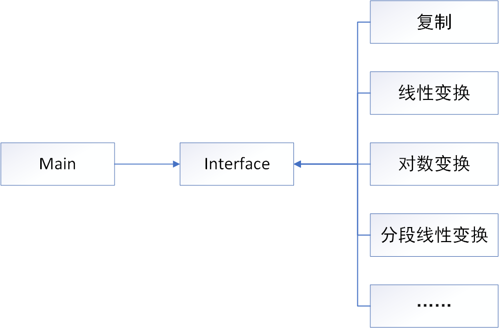
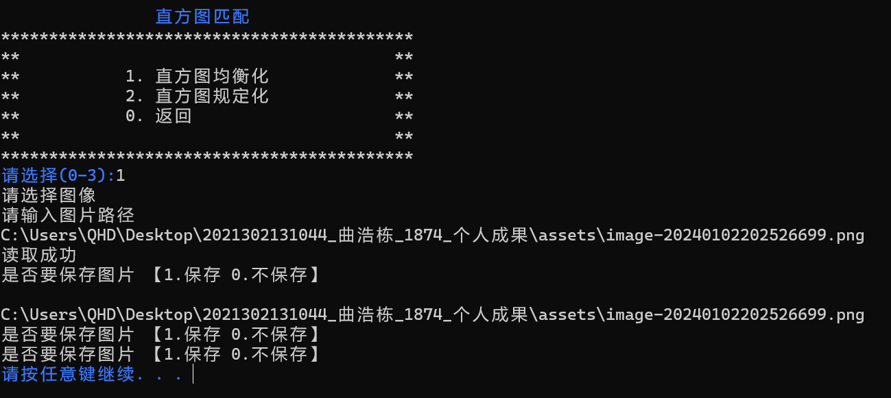

# 数字图像处理课程实习

## 编译环境

- VS 2019
- OpenCV 450

## 文件内容

- dip7Q.cpp源码文件
- dip7Q.exe可执行文件（需要与opencv_world450d.dll置于同一路径下）

## 实现的功能

- 灰度变换
  - 统一接口
  - 复制、线性变换、对数变换、分段线性变换……
  - 变换函数可视化
- 空间滤波
  - 算子类，实现任意算子的空间滤波
  - 中值滤波、快速中值滤波
- 几何变换
  - 链式编程实现几何变换
- 直方图匹配
  - 直方图均衡化、直方图规定化
  - 直方图可视化
- 菜单功能
  - 一个基于宏定义的、可以广泛使用的命令行菜单设计思路

## 灰度变换

设计思路：统一接口、多种实现



函数设计：

```cpp
void greyTransformation(
	const Mat& inImage,
	Mat& outImage,
	Mat& TMat,
	void (*transFun)(const uchar& inValue, uchar& outValue, void* reservedWord),
	void* reservedWord = NULL);

inline void copyValue(const uchar& inValue, uchar& outValue, void* reservedWord);
inline void linearTrans(const uchar& inValue, uchar& outValue, void* reservedWor);
inline void logTrans(const uchar& inValue, uchar& outValuet, void* reservedWord);
inline void piecewiseLinearTrans(const uchar& inValue, uchar& outValue, void* reservedWord);
```

## 空间滤波

设计思路：算子类实现任意算子的空间滤波；中值滤波和快速中值滤波单独实现

函数设计：

```cpp
enum OperType { Lowpass, HighPass };
class Operator {
public:
	Operator(OperType type);
	Operator();
	vector<double>m_value;
	unsigned int m_size;
};
	

void linearFilter(const Mat& inImage, Mat& outImage, const Operator& oper);
void midFilter(const Mat& inImage, Mat& outImage, int size);
void fastMidFilter(const Mat& inImage, Mat& outImage, unsigned int diameter);
```

## 几何变换函数

设计思路：使用引用实现链式编程

函数设计：

```cpp
class TransMat {
public:
	TransMat();
	vector<vector<double>>m_value;
	TransMat& SetTranslation(double p, double q);
	TransMat& SetScaling(double a, double b);
	TransMat& SetRotation(double ang);
	bool IsZeros();
	void Clear();
	vector<vector<double>> GetTranspose();

};

void geometricTrans(const Mat& inImage, Mat& outImage, Mat& outImagePart, TransMat& transMat);
void pointTrans(const Vec2d& inVec, Vec2d& outVal, vector<vector<double>>& T);
```

## 直方图匹配

设计思路：

函数设计：

```cpp
class Histogram {
public:
	Histogram();
	Histogram(int i);
	vector<int>m_sum;
	vector<double>m_p;
	int m_all;
	void Draw(Mat& outImage);

};

void histogramStat(const Mat& inImage, Histogram& hist);
void histogramMatching(const Histogram& src, const Histogram& dst, map<uchar, uchar>& index);
void transHistogram(const Mat& inImage, Mat& outImage, map<uchar, uchar>& index);
```

## 菜单设计

使用 switch...case... 语句以及宏定义实现命令行菜单



